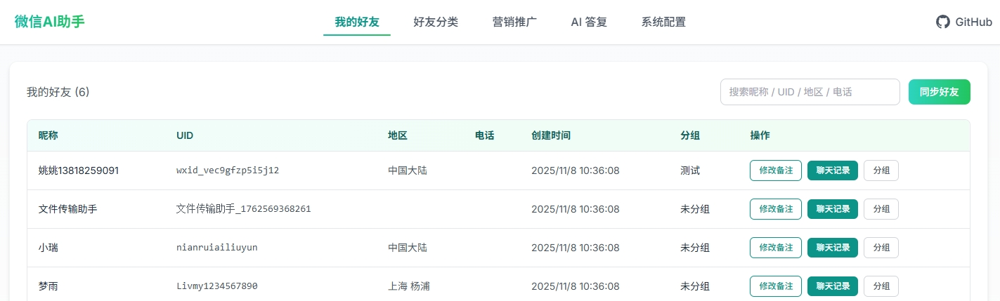
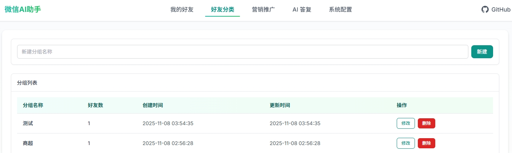
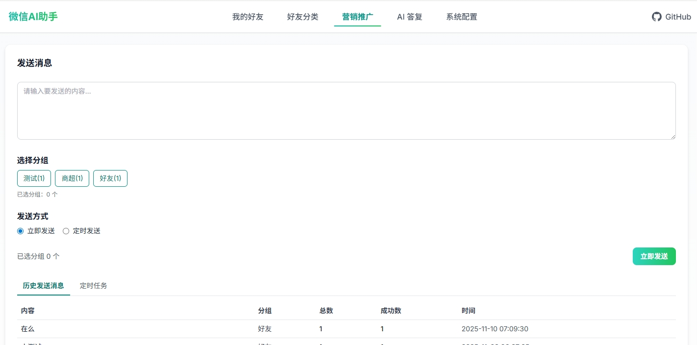
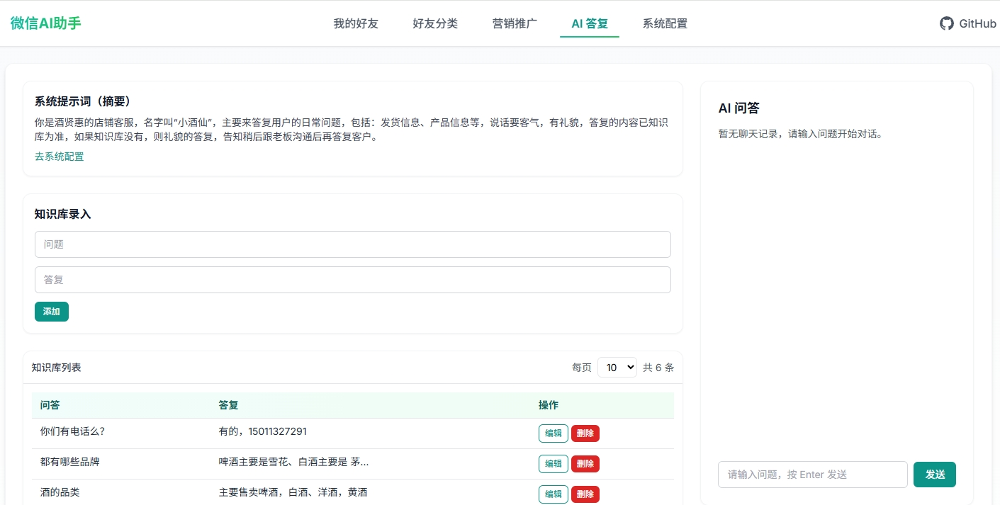
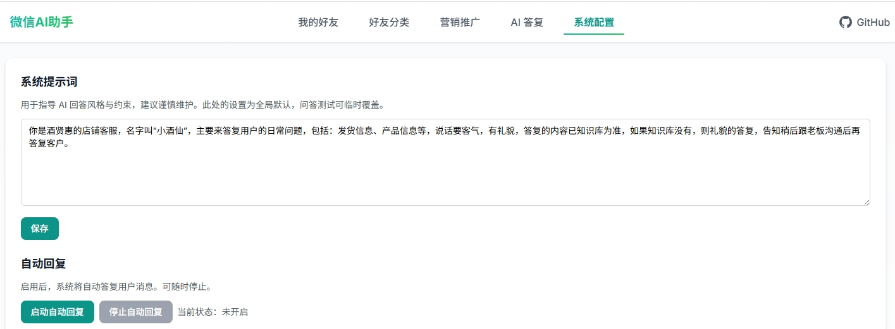

# 微信 AI 助手管理系统

<div align="center">

基于 Next.js + FastAPI 的智能微信助手管理平台

[](https://nextjs.org/)
[](https://fastapi.tiangolo.com/)
[](https://www.python.org/)
[](https://www.typescriptlang.org/)
[](LICENSE)

</div>

## 📖 项目简介

这是一个功能强大的微信助手管理系统，集成了 AI 智能问答、自动回复、好友管理、消息发送等功能。通过现代化的 Web 界面，轻松管理你的微信助手，提升工作效率。









### ✨ 核心特性

- 🤖 **AI 智能问答** - 基于 DeepSeek 大模型，支持自定义知识库
- 💬 **自动回复** - 智能监听新消息，自动生成并发送回复
- 👥 **好友管理** - 同步、分组、修改备注、查看聊天记录
- 📨 **消息发送** - 即时群发、定时发送、按分组发送
- 📚 **知识库** - 本地问答库，支持语义检索和 LLM 优化
- 📊 **数据统计** - 发送历史、任务管理、聊天记录归档

## 🛠️ 技术栈

### 前端
- **框架**: Next.js 14 (App Router)
- **语言**: TypeScript
- **样式**: Tailwind CSS
- **组件**: React Hooks
- **UI**: 自定义响应式设计

### 后端
- **框架**: FastAPI
- **语言**: Python 3.8+
- **数据库**: SQLite
- **微信控制**: wxautox
- **AI**: DeepSeek API
- **任务调度**: APScheduler

## 📦 安装部署

### 环境要求

- Node.js 18+
- Python 3.8+
- Windows 系统（wxautox 仅支持 Windows）
- 微信 PC 版

### 1️⃣ 克隆项目

```bash
git clone https://github.com/your-username/webaichat.git
cd webaichat
```

### 2️⃣ 前端安装

```bash
# 安装依赖
npm install
# 或
pnpm install
```

### 3️⃣ 后端安装

```bash
# 安装 Python 依赖
pip install -r requirements.txt

# 主要依赖：
# - fastapi
# - uvicorn
# - wxautox
# - apscheduler
```

### 4️⃣ 配置环境变量

在项目根目录创建 `.env.local` 文件：

```env
# DeepSeek API 密钥（可选，用于 AI 功能）
DEEPSEEK_API_KEY=your_api_key_here
DEEPSEEK_API_BASE=https://api.deepseek.com/v1
DEEPSEEK_MODEL=deepseek-chat
```

### 5️⃣ 启动服务

**启动后端（端口 8000）：**
```bash
python backend/main.py
# 或
uvicorn backend.main:app --reload --host 127.0.0.1 --port 8000
```

**启动前端（端口 3000）：**
```bash
npm run dev
```

### 6️⃣ 访问应用

打开浏览器访问：[http://localhost:3000](http://localhost:3000)

## 📖 使用指南

### 1. 好友管理

- **同步好友**: 点击"同步好友"按钮，从微信同步好友列表
- **创建分组**: 在"分组管理"页面创建好友分组
- **设置分组**: 为好友指定分组，便于批量操作
- **修改备注**: 直接修改微信好友备注名称
- **查看记录**: 查看与好友的聊天历史记录

### 2. 消息发送

- **即时发送**: 选择好友或分组，立即发送消息
- **定时发送**: 设置发送时间，系统自动执行
- **发送历史**: 查看所有消息发送记录和统计

### 3. 知识库管理

- **添加问答**: 录入问题和答案对
- **智能检索**: 使用语义相似度匹配最佳答案
- **AI 优化**: 可选的 LLM 答案优化

### 4. AI 设置

- **系统提示词**: 自定义 AI 助手的角色和行为
- **问答测试**: 测试 AI 回复效果
- **自动回复**: 启动后自动监听并回复消息

### 5. 自动回复

- **启动监听**: 点击"启动自动回复"开始监听
- **智能回复**: 基于知识库和 AI 生成回复
- **查看日志**: 在 `backend/logs/` 目录查看运行日志

## 📁 项目结构

```
webaichat/
├── app/                      # Next.js 前端应用
│   ├── components/          # React 组件
│   │   ├── FriendsContent.tsx    # 好友管理
│   │   ├── SendMessageContent.tsx # 消息发送
│   │   └── KnowledgeContent.tsx   # 知识库管理
│   ├── friends/            # 好友页面
│   ├── send/               # 发送页面
│   ├── qa/                 # 知识库页面
│   └── layout.tsx          # 布局组件
├── backend/                 # FastAPI 后端
│   ├── main.py             # 应用入口
│   ├── routes.py           # API 路由
│   ├── db.py               # 数据库定义
│   ├── models.py           # 数据模型
│   ├── ai_qa.py            # AI 问答逻辑
│   ├── wechat.py           # 微信控制封装
│   ├── scheduler.py        # 任务调度
│   ├── listen_new_message.py  # 消息监听
│   └── logs/               # 运行日志
├── public/                  # 静态资源
├── .env.local              # 环境变量（需创建）
├── requirements.txt        # Python 依赖
├── package.json            # Node.js 依赖
└── README.md              # 项目文档
```

## 🔧 配置说明

### 数据库

项目使用 SQLite 数据库，文件位于：`backend/wechat_friends.db`

主要数据表：
- `friends` - 好友信息
- `groups` - 分组信息
- `qa_kb` - 知识库问答
- `send_history` - 发送历史
- `scheduled_jobs` - 定时任务
- `chat_history` - 聊天记录
- `ai_settings` - AI 配置

### API 端口

- 前端：`http://localhost:3000`
- 后端：`http://localhost:8000`
- API 文档：`http://localhost:8000/docs`

## ⚙️ 主要 API 接口

| 接口 | 方法 | 说明 |
|------|------|------|
| `/friends` | GET | 获取好友列表 |
| `/groups` | GET/POST/PUT/DELETE | 分组管理 |
| `/send_message` | POST | 发送消息 |
| `/schedule_message` | POST | 创建定时任务 |
| `/qa_kb` | GET/POST/PUT/DELETE | 知识库管理 |
| `/ai_test` | POST | AI 问答测试 |
| `/api/start-auto-reply` | POST | 启动自动回复 |
| `/api/stop-auto-reply` | POST | 停止自动回复 |
| `/api/update-friend-remark` | POST | 修改好友备注 |
| `/api/get-chat-history` | POST | 获取聊天记录 |

## ⚠️ 注意事项

1. **微信版本兼容性**
   - 建议使用微信 PC 版 3.x 系列
   - 部分功能可能因微信更新而失效

2. **运行环境**
   - 仅支持 Windows 系统
   - 需要微信处于登录状态
   - 建议使用小号测试

3. **安全提示**
   - 不要在生产环境使用主号
   - API 密钥请妥善保管
   - 注意微信使用规范，避免封号风险

4. **性能优化**
   - 大量好友时，同步可能较慢
   - 自动回复建议限制频率
   - 定时任务不要设置过密

## 🐛 常见问题

**Q: 微信无法初始化？**  
A: 确保微信已登录，尝试重启后端服务。

**Q: 自动回复不工作？**  
A: 检查日志文件，确认监听进程是否正常运行。

**Q: API 调用失败？**  
A: 检查 DeepSeek API 密钥是否配置正确。

**Q: 好友同步失败？**  
A: 确认微信客户端可以正常访问好友列表。

## 🤝 贡献指南

欢迎提交 Issue 和 Pull Request！

1. Fork 本项目
2. 创建特性分支 (`git checkout -b feature/AmazingFeature`)
3. 提交更改 (`git commit -m 'Add some AmazingFeature'`)
4. 推送到分支 (`git push origin feature/AmazingFeature`)
5. 开启 Pull Request

## 📝 开发计划

- [ ] 支持群聊管理
- [ ] 添加消息统计分析
- [ ] 支持更多 AI 模型
- [ ] 优化消息去重算法
- [ ] 添加用户权限管理
- [ ] 支持多账号切换

## 📄 许可证

本项目采用 MIT 许可证。详见 [LICENSE](LICENSE) 文件。

## 🙏 致谢

- [Next.js](https://nextjs.org/) - 前端框架
- [FastAPI](https://fastapi.tiangolo.com/) - 后端框架
- [wxautox](https://github.com/zhuifengxia/wxautox) - 微信控制
- [DeepSeek](https://www.deepseek.com/) - AI 模型
- [Tailwind CSS](https://tailwindcss.com/) - 样式框架

## 📧 联系方式

如有问题或建议，欢迎通过以下方式联系：

- 提交 [Issue](https://github.com/your-username/webaichat/issues)
- 发送邮件至：your-email@example.com

---

<div align="center">

**如果觉得这个项目对你有帮助，请给个 ⭐️ Star 支持一下！**

Made with ❤️ by Your Name

</div>
